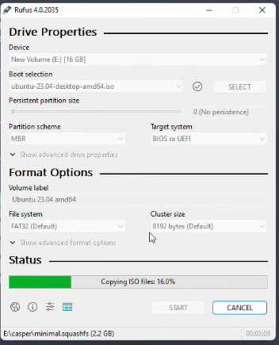
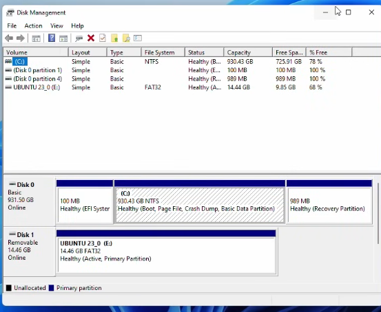
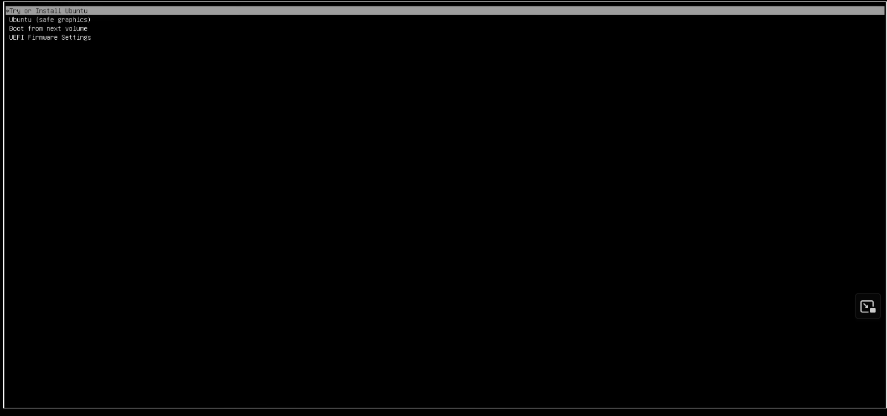
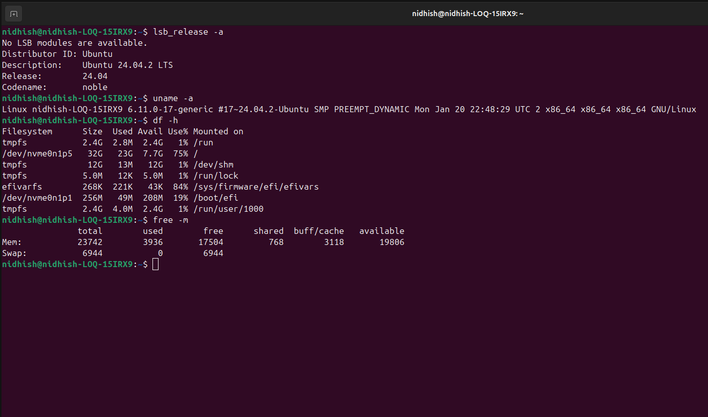

# Dual-boot Ubuntu — Step-by-step tutorial 

> **Warning:** Dual-booting modifies partitions and bootloaders. A single wrong command may make data inaccessible. **Back up** all important data first (external drive, cloud). This tutorial explains manual steps and includes a *safe helper script* that only gathers information and guides you — it will not perform destructive partition changes unless you explicitly confirm.

---

## Table of contents

1. Goals and assumptions
2. Prerequisites checklist
3. High-level plan
4. Full step-by-step manual instructions
   - Backup
   - Prepare bootable USB
   - Shrink Windows partition (if applicable)
   - Create partitions for Ubuntu
   - Install Ubuntu
   
   - Post-install checks
5. Troubleshooting and tips
6. References & further reading

---

## 1) Goals and assumptions

- You want to install Ubuntu alongside an existing OS (usually Windows) on the same machine and be able to choose at boot.
- This guide assumes:
  - You have a modern PC using BIOS (legacy) *or* UEFI. Steps differ slightly — pay attention to UEFI notes.
  - You can boot from USB and change boot order in firmware (BIOS/UEFI) settings.
  - You understand how to boot into firmware/BIOS and can access Disk Management (Windows) or GParted (Linux live).

---

## 2) Prerequisites checklist

- ✅ External backup of personal files (required)
- ✅ A USB stick (4 GB+ for server, 8 GB+ recommended for desktop ISO)
- ✅ Ubuntu ISO downloaded (desktop image) — verify checksum if possible
- ✅ Rufus (Windows) or `dd` / `balenaEtcher` / `gnome-disks` (Linux) to make bootable USB
- ✅ Enough free disk space to create root (`/`) partition (20–40 GB recommended) and optional swap/home
- ✅ Time and patience

---

## 3) High-level plan

1. Back up everything.
2. Make a bootable USB with the Ubuntu ISO.
3. Shrink your existing OS partition (if needed) to free space.
4. Boot the Ubuntu live USB and run the installer — create partitions in the free space.
5. Install the bootloader (GRUB) to the correct target (UEFI: the system EFI partition; BIOS: the disk MBR).
6. Reboot and choose the OS from the GRUB menu.

---

## 4) Full step-by-step manual instructions

### A — Backup (do not skip)

- Copy Documents, Pictures, important profiles, browser bookmarks, and any activation keys to an external drive.
- If you have BitLocker (Windows), decrypt or suspend it before resizing partitions.

### B — Prepare a bootable USB

**Windows users:** Use Rufus.
1. Download Rufus (rufus.ie).
2. Select the Ubuntu ISO and the USB device.
3. For UEFI machines use GPT + FAT32; for BIOS use MBR.
4. Create the USB.



### C — Shrink Windows partition (if you have Windows)

1. Boot into Windows.
2. Open Disk Management (`diskmgmt.msc`).
3. Right-click the Windows (C:) partition → **Shrink Volume**.
4. Choose how much space to free (20–40 GB or more). Apply.

If Windows refuses to shrink enough, disable hibernation and pagefile temporarily:

```powershell
# Run as admin in PowerShell
powercfg /h off
```

Then reboot and retry shrinking.


### D — Boot live USB and create partitions

1. Insert the Ubuntu USB and boot from it (choose "Try Ubuntu" first if you want to test hardware).
2. Launch *GParted* (if not installed, you can open `gnome-disks` or use the installer partitioner).
3. In the freed space create the following (example):
   - `Root` (`/`) partition — ext4, 30–50 GB
   - `Swap` — either a swap file created later (preferred) or a swap partition (1–8 GB depending on RAM and hibernation needs)
   - Optional `Home` (`/home`) partition — ext4, rest of the space if you want separation

**UEFI note:** Keep the existing EFI System Partition (ESP) — do NOT format it. Mount it as `/boot/efi` during install.

### E — Run Ubuntu installer

1. Start the installer.
2. When asked for Installation type choose **Something else** (manual partitioning) for control.
3. Assign mount points:
   - Select the ext4 partition → edit → use as ext4 → mount point `/` → format as ext4 (only if you want to erase anything there)
   - If using EFI, choose the existing EFI partition (vfat) and set mount point `/boot/efi` — do NOT format unless you know what you're doing.
4. Device for bootloader installation:
   - UEFI: typically your main disk (e.g. `/dev/nvme0n1`) — installer will install GRUB into the EFI.
   - BIOS: choose the disk's MBR (e.g. `/dev/sda`).

5. Proceed with the installation and reboot when finished.


### F — First boot & GRUB troubleshooting

- After reboot you should see the GRUB menu listing Ubuntu and Windows. If you boot straight into Windows, try the following:
  - Enter firmware/BIOS -> Boot order -> select Ubuntu/GRUB (or disable Windows Boot Manager priority).
  - If that fails: Boot from USB again, choose "Try Ubuntu" → install and run `boot-repair` (see Troubleshooting below).


---


## 5) Troubleshooting and tips

- **No GRUB menu, boots straight to Windows:** Check UEFI Boot Order (disable Windows Boot Manager or move Ubuntu/GRUB up). If required, use `boot-repair`:
  - Boot live USB → `sudo add-apt-repository ppa:yannubuntu/boot-repair && sudo apt update && sudo apt install -y boot-repair` → run `boot-repair`.
- **Windows not visible in GRUB:** In Ubuntu run `sudo update-grub`.
- **Cannot boot live USB on UEFI:** Ensure the USB is FAT32 and supports UEFI or disable Secure Boot temporarily.
- **Wanted to use LVM or full-disk encryption?** You can choose these during the installer (advanced); full disk encryption is powerful but increases complexity for recovery.

---

## 6) References & further reading

- Ubuntu official installation guide — follow Ubuntu's pages for the particular release you use.
- Rufus documentation for creating UEFI-bootable USBs.

---


## 7) Check if ubuntu is installed correctly 

## lsb_release -a (shows Ubuntu version).
```bash
lsb_release -a 
```

## uname -a (gives info about the kernel).
```bash
uname -a 
```

## df -h - Shows disk usage.
```bash
df -h 
```

## free -m - Shows memory usage.
```bash
free -m 
```




### REFLECTION ON THE INSTALLATION 

## PROBLEMS FACED BY ME 
- Windows partition fails to shrink , happens if there are unmovable files. Workaround: disable hibernation & fast startup in Windows, defragment, then shrink.
- Fast Startup / Hibernation locks NTFS partition ,causes Ubuntu to mount Windows partitions read-only or not at all. Fix: disable Fast Startup in Windows power options
- BitLocker encryption blocking Ubuntu access ,if BitLocker is on, Ubuntu may not read the Windows disk until you unlock/decrypt it. Suspend BitLocker before dual-boot.


## Extra Question 
## What are two advantages of dual booting instead of using a VM?


## 1️⃣ Full Hardware Performance
- In a dual-boot setup, Ubuntu (or any OS) runs directly on your hardware.
- You get the full power of your CPU, GPU, and RAM without the virtualization overhead.


## 2️⃣ Better Hardware Compatibility & Access
- Dual boot allows direct access to your hardware — Wi-Fi cards, USB devices, external drives, and graphics drivers.
- Some devices (like NVIDIA GPUs or advanced USB controllers) can be tricky or limited inside a VM.


## 💡 Bonus thought: dual boot also gives you the real experience of using that OS as your daily driver, not just inside a “sandbox.”