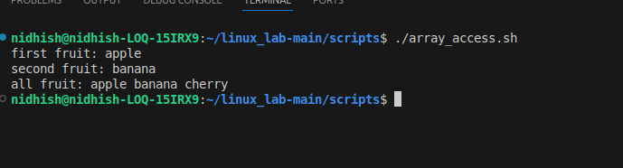
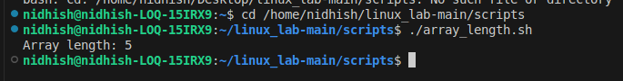

## 1) ARRAY LENGTH
# Bash Array Length Example

This script demonstrates how to declare an array in bash and print its length.

## Script
 ```bash
 #!/bin/bash

numbers=(10 20 30 40 50)
echo "Array length: ${#numbers[@]}"
```


## EXPLAINATION:
**Script Breakdown**

## Explanation

- `numbers=(10 20 30 40 50)`  
  Declares an array called **numbers** containing the elements 10, 20, 30, 40, and 50.

- `echo "Array length: \${#numbers[@]}"`  
  Uses the special bash syntax `${#numbers[@]}` to get the **number of items** in the `numbers` array (which is 5 in this case), and prints it out.

### Key Syntax

- **`${#array[@]}`** returns the count of elements in the array. This is useful in scripts to check array size or iterate over elements.

## Example Output:



## 2) Array Access
# Bash Array Element Access Example

This script demonstrates how to declare an array in bash and access individual and all elements.

## Script
```bash
#!/bin/bash

fruits=("apple" "banana" "cherry")

echo "first fruit: ${fruits[0]}"
echo "second fruit: ${fruits[1]}"
echo "all fruit: ${fruits[@]}"
```


## Explanation

- `fruits=("apple" "banana" "cherry")`  
  Declares an array called **fruits** with three elements: apple, banana, and cherry[web:34].

- `echo "first fruit: \${fruits}"`  
  Prints the first fruit in the array, which is `"apple"`. Array indices in bash start at 0[web:34][web:39].

- `echo "second fruit: \${fruits[9]}"`  
  Prints the second fruit, `"banana"`, using its index[web:34][web:39].

- `echo "all fruit: \${fruits[@]}"`  
  Prints all fruits in the array, separated by spaces. The `[@]` syntax expands to all elements in the array[web:34][web:35].

## Example Output



## Extra Questions 

## 1) What is the purpose of #!/bin/bash at the top of a script?
- The purpose of #!/bin/bash at the top of a script is to tell the operating system to use the Bash shell interpreter to execute the script, regardless of the user's current shell.
- The line #! followed by the path to an interpreter (like /bin/bash) is called a shebang.
- When the script is run as an executable, the system uses the specified interpreter to process the commands in the script, ensuring predictable behavior.


## 2) How do you make a script executable?
**To make a script executable in Linux bash, the main step is to give the script file execute permission using the chmod command**

Steps to Make a Script Executable:
1. Create your script file, e.g., myscript.sh and add your shebang line and commands:
```bash
#!/bin/bash
echo "Hello World!"
```
2. Give execute permission to the script using:
```bash
chmod +x myscript.sh
```

3. Run the script by specifying its path:
```bash
./myscript.sh
```
**This is the standard and recommended way to make and run bash scripts executable on Unix-like systems.**


