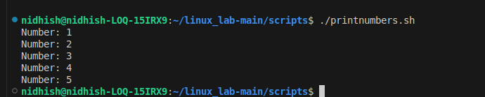
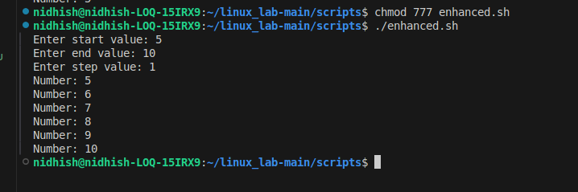

## **Modifying an existing script** 
**Existing script**:
```bash
#!/bin/bash

for i in 1 2 3 4 5
do
  echo "Number: $i"
done
```


## Output



## Modified script 
**Includes Start ,End and Step values taken from the user**

**Script**
```bash
#!/bin/bash

# Ask user for input values
read -p "Enter start value: " start
read -p "Enter end value: " end
read -p "Enter step value: " step

# Loop from start to end with the given step
for (( i=$start; i<=$end; i+=step ))
do
  echo "Number: $i"
done
```

## Output:



# Original vs Modified Bash Script Behavior

This document explains the difference in behavior between the original bash script and the modified version where user inputs define the start, end, and step values in a loop.

## Original Script Behavior

- The original script uses a **fixed list** of numbers (`1 2 3 4 5`) to iterate over.
- The loop runs exactly 5 times, printing the numbers from 1 to 5.
- There is no user input; the sequence is hard-coded in the script.
- The numbers are explicitly listed, so the script behavior is static and predictable.
- The loop uses a **word list iteration** style where each value is a separate item in the list [web:56].

## Modified Script Behavior


- The modified script **prompts the user** to input the start, end, and step values before running the loop.
- It uses a **C-style for loop** which supports arithmetic expressions, allowing flexible iteration with variable step increments.
- The loop runs based on user input, so its behavior can change dynamically:
  - It can count forwards or backwards (if step sign is adjusted).
  - The number of iterations can vary widely depending on inputs.
- This makes the script **interactive** and more reusable in different scenarios.
- The script is less predictable upfront but more versatile[web:24][web:36].

## Summary of Differences

| Aspect               | Original Script                | Modified Script                      |
|----------------------|-------------------------------|------------------------------------|
| Loop control         | Fixed list of values           | User-defined start, end, and step  |
| Interaction          | None (static)                  | Interactive (prompts user input)   |
| Loop style           | Word list iteration            | C-style arithmetic iteration       |
| Flexibility          | Limited to fixed 1-5 sequence  | Flexible to any numeric sequence   |
| Use cases            | Simple, known iteration        | Dynamic, customizable iteration    |

The modification adds flexibility and user interaction but requires user input validation for robust use in production scripts.


## Extra Questions 
## 1) Difference between $1, $@, and $# in bash?

# Difference between `$1`, `$@`, and `$#` in Bash

In bash scripting, the special variables `$1`, `$@`, and `$#` are used to handle script or function arguments:

| Variable | Description                                         | Example Usage                            | Notes                                                         |
|----------|-----------------------------------------------------|-----------------------------------------|---------------------------------------------------------------|
| `$1`     | The **first positional argument** passed to the script or function | `echo "First argument: $1"`              | Accesses the first argument only                              |
| `$@`     | **All positional arguments** passed, as separate quoted strings  | `for arg in "$@"; do echo "$arg"; done` | Expands to all arguments preserving each as a separate entity |
| `$#`     | The **number of positional arguments** passed      | `echo "Total arguments: $#"`              | Useful for checking how many arguments were given             |

## Explanation

- `$1` allows you to access specific arguments individually by their position.
- `$@` is useful when you want to iterate over all arguments as a list.
- `$#` tells you how many arguments the script or function has received.

## Example Script

```bash
#!/bin/bash
echo "First argument: $1"
echo "All arguments: $@"
echo "Number of arguments: $#"
```

Running `./script.sh apple banana cherry` will output:

First argument: apple
All arguments: apple banana cherry
Number of arguments: 3


## What does exit 1 mean in a script?
# Meaning of `exit 1` in a Bash Script

In a Bash script, the command `exit 1` is used to **terminate the script and indicate an error condition** or failure to the operating system or calling process.

## Details

- `exit` ends the execution of the script immediately.
- The number `1` is an **exit status code** signaling that an error or failure occurred.
- By convention, an exit status of **0 means success**, and **any non-zero value (like 1) indicates a failure or error**.
- Exit codes help other programs, scripts, or users identify if the script completed successfully or if there was a problem during execution.

## Typical Use Case

```bash
#!/bin/bash

if ! ls example.txt; then
echo "Error: example.txt not found."
exit 1 # Exit with failure status
fi

echo "File found, proceeding..."
```


In the example above:

- If `example.txt` does not exist, the script prints an error and exits with status 1.
- This signals an error to the caller, which can then handle the failure accordingly.

## Summary Table

| Exit Code | Meaning                          |
|-----------|---------------------------------|
| `0`       | Success (no errors)             |
| `1`       | General error or failure        |
| Other     | Specific errors (varies by code)|

## Why Use `exit 1`?

- To inform other scripts or tools that a problem occurred.
- To stop further execution of the script after detecting an error.
- To provide a clear status code for debugging and automation workflows.

This makes scripts more robust by enabling error detection and proper handling.


