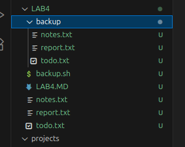

# backup.sh Script Documentation

## Script
```bash
#!/bin/bash

# Create backup directory if it doesn't exist
mkdir -p backup

# Get current timestamp in YYYYMMDD_HHMMSS format
timestamp=$(date +"%Y%m%d_%H%M%S")

# Find all .txt files in the current directory and copy them with timestamp
for file in *.txt
do
  # Check if the file exists (in case no .txt files are found)
  if [ ! -e "$file" ]; then
    echo "No .txt files found to backup."
    exit 0
  fi
  # Copy with timestamp appended before the extension
  cp "$file" "backup/${file%.txt}_$timestamp.txt"
done

echo "Backup completed."
```

## How the Script Works

- The script first creates a directory named `backup` in the current folder if it does not exist already, using `mkdir -p backup`.
- It then searches for all files with the `.txt` extension in the current directory using a `for` loop over `*.txt`.
- For each `.txt` file found, the script copies it directly into the `backup/` directory without changing the filename.
- If no `.txt` files are found, the script outputs a message and exits gracefully.
- After processing all `.txt` files, it prints a message: "Backup completed."

This approach allows quick backup of all text files in the current working directory into a designated backup folder.

## Example Run

1. Assume the current directory contains these text files:
- notes.txt
- report.txt
- todo.txt


2. Run the script:
- ./backup.sh
- Expected output - Backup completed.


3. Check the `backup/` directory, which will now contain:
- notes.txt
- report.txt
- todo.txt





**These files are copies of the originals, safely stored in the `backup` folder.**

---

**This simple backup script helps organize text file backups without overwriting or renaming, making it easy to maintain copies of important `.txt` files.**


## Extra Questions

# 1) What is the difference between cp, mv, and rsync?

# Difference Between `cp`, `mv`, and `rsync`

These are common Linux commands used for copying and moving files, but they serve different purposes and have different features.

| Command | Purpose | Key Features | Typical Use Cases |
|---------|---------|--------------|------------------|
| `cp`    | Copy files and directories | Simple file copy; can preserve attributes with `-p` option; recursively copy directories with `-r` | Quick local copies of files or directories |
| `mv`    | Move or rename files and directories | Moves files/directories, preserving attributes; changes location or filename without making a copy | Renaming files, moving files to a different location |
| `rsync` | Synchronize files/directories efficiently | Copies only differences after initial sync; can preserve metadata with `-a`; supports network transfers; can delete files from destination to mirror source | Backups, syncing large datasets, network copies, mirroring folders |

## Details

### cp
- Copies files or directories locally.
- Requires additional options to preserve ownership, timestamps, and permissions (e.g., `cp -p`).
- Copies everything each time even if files are unchanged.

### mv
- Moves files or directories to a new location or renames them.
- Does not create a duplicate; the original is removed.
- Faster for renaming or relocating within the same file system.

### rsync
- Designed for efficient syncing of files/directories.
- After initial copy, it transfers only changed parts of files (delta-transfer algorithm).
- Can preserve all file metadata with `-a` (archive) option.
- Supports copying over the network and has many options for control, such as compression and deletion.
- Ideal for backups and incremental file synchronization.

## Summary

- Use **`cp`** for straightforward copying tasks.
- Use **`mv`** when you want to move or rename files without duplication.
- Use **`rsync`** for powerful, efficient syncing and backup, especially with large or networked datasets.

---

### Example Commands

```bash
cp -r source_dir/ dest_dir/ # Copy directory recursively
mv file.txt /backup/file.txt # Move (or rename) a file
rsync -av source_dir/ dest_dir/ # Sync directories with archive mode
```

