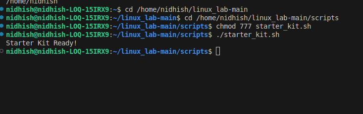

# Lab 5 – Starter Kit & Automation

## Objective

Build a starter project environment **automatically** with a script.

---

## Tasks

### 1. Write `starter_kit.sh` to:

- **Create folders:**
  - `project/`
    - `scripts/`
    - `docs/`
    - `data/`
- **Add placeholder `README.md`** in each folder.
- **Print `Starter Kit Ready!`** at the end.

### Sample `starter_kit.sh`
```bash
#!/bin/bash
#Create folder structure

mkdir -p project/scripts project/docs project/data
#Add README.md to each folder

echo "# Scripts Folder" > project/scripts/README.md
echo "# Docs Folder" > project/docs/README.md
echo "# Data Folder" > project/data/README.md

echo "Starter Kit Ready!"
```


---


- **Purpose of script:**  
  The script automates the creation of a starter project structure with necessary folders and placeholder files, saving setup time and ensuring consistency.


---

### Extra Questions

**Q: What does `mkdir -p` do?**  
A: The `-p` flag allows `mkdir` to create parent directories as needed and prevents errors if the folders already exist.

**Q: Why is automation useful in DevOps?**  
A: Automation ensures tasks are repeatable, reduces manual errors, speeds up processes, and frees humans to focus on more valuable activities—all essential for efficient DevOps workflows.

---


