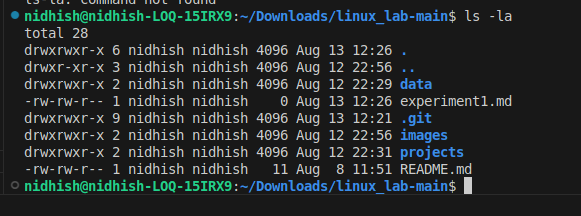

#       Heading 1
##      Heading 4
###     Heading 3

Plaing Text

```bash
>> pwd
```

# The output is as follows

```
~/Downloads/linux_lab-main

```

### Linux Basic Commad 
``` bash
>> ls
```
Explanation : The ls command lists all the files and folders present

### The output of the commands is as below

