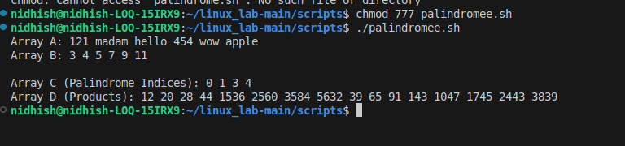

# Palindrome--Prime Processing Script

## Full Bash Script

``` bash
#!/bin/bash
# Program: palindrome_prime_process.sh
# Description: Process two arrays — one for palindromes, one for primes — and generate two output arrays.

# ---------- Input Arrays ----------
# You can modify these or take input dynamically
ArrayA=("121" "madam" "hello" "454" "wow" "apple")
ArrayB=(3 4 5 7 9 11)

# ---------- Step 1: Identify palindrome positions ----------
is_palindrome() {
    local str="$1"
    local rev
    rev=$(echo "$str" | rev)
    [[ "$str" == "$rev" ]]
}

# ---------- Step 2: Identify prime numbers ----------
is_prime() {
    local n=$1
    if (( n <= 1 )); then
        return 1
    fi
    for (( i=2; i*i<=n; i++ )); do
        if (( n % i == 0 )); then
            return 1
        fi
    done
    return 0
}

# ---------- Step 3: Process arrays ----------
C=()   # Stores indices of palindromes
D=()   # Stores products (sum * prime)

palindromes=()
primes=()

# Find palindrome positions and their values
for (( i=0; i<${#ArrayA[@]}; i++ )); do
    if is_palindrome "${ArrayA[i]}"; then
        C+=($i)
        palindromes+=("${ArrayA[i]}")
    fi
done

# Find prime numbers
for num in "${ArrayB[@]}"; do
    if is_prime "$num"; then
        primes+=("$num")
    fi
done

# ---------- Step 4: Calculate products ----------
for p in "${palindromes[@]}"; do
    if [[ "$p" =~ ^[0-9]+$ ]]; then
        # Numeric palindrome → sum of digits
        sum=0
        for (( j=0; j<${#p}; j++ )); do
            sum=$(( sum + ${p:j:1} ))
        done
    else
        # String palindrome → sum of ASCII values
        sum=0
        for (( j=0; j<${#p}; j++ )); do
            asc=$(printf "%d" "'${p:j:1}")
            sum=$(( sum + asc ))
        done
    fi

    for prime in "${primes[@]}"; do
        D+=($(( sum * prime )))
    done
done

# ---------- Step 5: Output ----------
echo "Array A: ${ArrayA[@]}"
echo "Array B: ${ArrayB[@]}"
echo
echo "Array C (Palindrome Indices): ${C[@]}"
echo "Array D (Products): ${D[@]}"
```

------------------------------------------------------------------------

## Explanation

This script processes two arrays:\
- **Array A** → contains strings or numbers\
- **Array B** → contains integers

The script performs the following tasks:

------------------------------------------------------------------------

### 🔹 1. Palindrome Detection

A custom function `is_palindrome()` checks if a value reads the same
backward:

``` bash
rev=$(echo "$str" | rev)
[[ "$str" == "$rev" ]]
```

All indices where palindromes occur are stored in **Array C**, and the
palindrome values are stored in `palindromes[]`.

------------------------------------------------------------------------

### 🔹 2. Prime Number Detection

The function `is_prime()` verifies if a number from Array B is prime by
testing divisibility up to √n.

Valid primes are stored in `primes[]`.

------------------------------------------------------------------------

### 🔹 3. Processing Palindromes

Each palindrome is processed:

-   If it's **numeric**, the script computes the **sum of its digits**.\
-   If it's a **string palindrome**, it computes the **sum of ASCII
    values** of each character.

------------------------------------------------------------------------

### 🔹 4. Generating Output Products (Array D)

For every palindrome sum, the script multiplies it with **each prime
number**:

    (sum of palindrome characters) × (prime)

All resulting values are appended to **Array D**.

------------------------------------------------------------------------

### 🔹 5. Output



------------------------------------------------------------------------

## ✔ Summary Table

  Step   Description
  ------ -----------------------------------
  1      Detect palindromes in Array A
  2      Detect primes in Array B
  3      Compute digit/ASCII sums
  4      Multiply each sum with each prime
  5      Print Arrays C and D

------------------------------------------------------------------------

