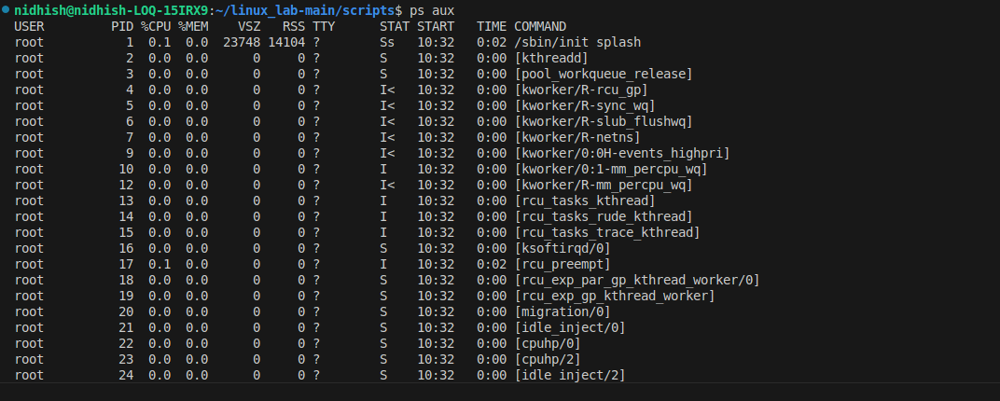
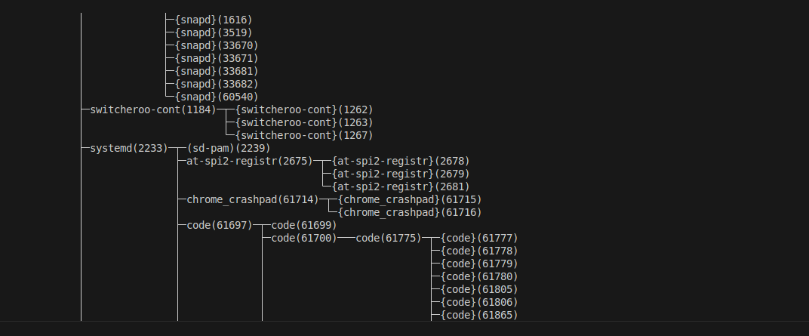
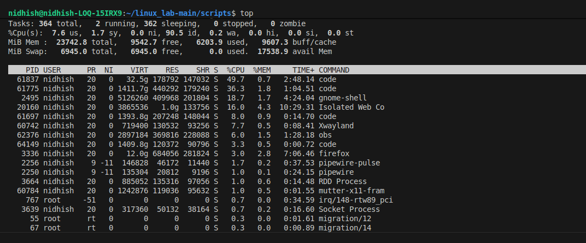

# 🐧 Process Management in Linux

This document explains common Linux commands for monitoring and managing processes, along with examples and explanations.

---

## 📜 1. View All Processes (`ps aux`)

```bash
- ps aux → show running processes
- Options:
-   a → show processes for all users
-   u → show user/owner of process
-   x → show processes not attached to a terminal

ps aux
```
# OUTPUT EXAMPLE 



# 🌲 2. Process Tree (pstree -p)

 pstree -p → show processes in tree structure
 -p → display PIDs (process IDs)
```bash
pstree -p
```

# OUTPUT 



# 📊 3. Real-Time Monitoring (top)
- top → real-time process and system resource monitor
- Shows CPU, memory, tasks, and running processes
- Press 'q' to quit
```bash
top
```



# ⚡ 4. Adjust Process Priority (nice & renice)
- nice → start a process with defined priority
- renice → change priority of an existing process
- Lower nice value = higher priority

- Start a process with low priority (nice = 10)
```bash
nice -n 10 sleep 300 &
```
- Change priority of a running process (PID 3050)
```bash
renice -n -5 -p 3049
```

# OUTPUT 


# 🔧 5. CPU Affinity (taskset)
- taskset → bind process to specific CPU cores
- -c → specify cores

- Show current affinity of PID 3050
```bash
taskset -cp 3049
```
- Restrict process to core 1 only
```bash
taskset -cp 1 3049
```

# OUTPUT


# 📂 6. I/O Scheduling Priority (ionice)
- ionice → set disk I/O priority of a process
- Class 3 (idle) → process only gets I/O when system is idle
```bash
ionice -c 3 -p 3049
```


# 📑 7. File Descriptors (lsof)
- lsof → list open files used by a process
 - In Linux, everything is a file (sockets, pipes, devices, etc.)
```bash
lsof -p 3049 | head -5
```


# 🐛 8. Trace System Calls (strace)
- strace → trace system calls of a process
- Useful for debugging why a process is stuck
```bash
strace -p 3049
```

# 📡 9. Find Process Using a Port (fuser)

- fuser → find which process is using a given port
- -n tcp → check TCP port usage
```bash
sudo fuser -n tcp 8080
```


# 📊 10. Per-Process Statistics (pidstat)
- pidstat → display per-process CPU usage over time
- -p <PID> <interval> <count>
- Example: sample every 2 sec, 3 times
```bash
pidstat -p 3049 2 3
```

# OUTPUT


# 🔐 11. Control Groups (cgroups)
- cgroups → limit CPU, memory, I/O usage of processes
- cgcreate → create new cgroup
- echo → set resource limits
- Add PID to cgroup by writing to cgroup.procs

- Create a new cgroup
```bash
sudo cgcreate -g cpu,memory:/testgroup
```
- Limit CPU quota and memory
```bash
echo 50000 | sudo tee /sys/fs/cgroup/cpu/testgroup/cpu.cfs_quota_us
echo 100M   | sudo tee /sys/fs/cgroup/memory/testgroup/memory.limit_in_bytes
```
- Add process (PID 3049) to the group
```bash
echo 3049 | sudo tee /sys/fs/cgroup/cpu/testgroup/cgroup.procs
```
